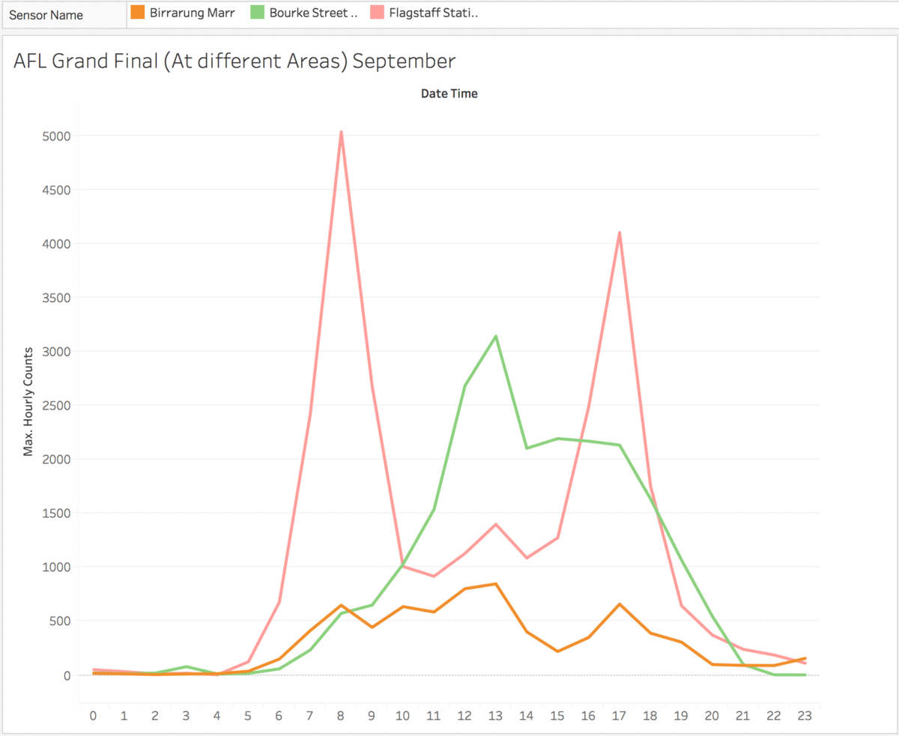

## Do Our Movements Have Patterns?

One of my earliest projects was part of a capstone project for the Data Science Immersive course I did in General Assembly Sydney. I wanted to look at the patterns in the way we move around in a space and how many of our patterns can be predictable. 

We’re each our own individuals but very often we move along in crowds. Take for example, leaving a venue after a concert. Usually the exits are highlighted for us, there’ll be a couple of exits. A lot of us are going to follow the crowd to the nearest one, some of us know certain exits are closer to our cars, so we’ll move to those. But it’s with this majority that we can identify patterns with. 
It's not weird that we all follow a certain pattern depending on our surroundings or the place we live in.

<iframe width="560" height="315" src="https://www.youtube.com/embed/QWuHTXufElU" frameborder="0" allowfullscreen></iframe>

So what about in a city? This is movement in Melbourne during the AFL Grand Final, you can see in the bottom right corner in Birrarung, the bubble getting bigger in noon time where a bunch of people are going into the grounds to watch the game and then again at 6pm to go home. During this time, areas with transport links start to spike as well, whilst others remain at a constant.

Same concept, after a long day at work, we follow the nearest exit or station to go home. Sometimes, we have somewhere else to go apart from home.

